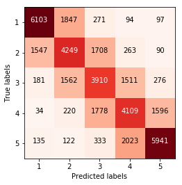
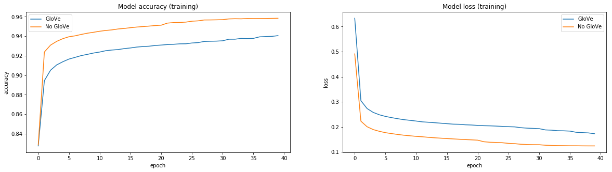

# Text classification with Convolution Neural Networks (CNN)
This is a project to classify text documents / sentences with CNNs. You can find a great introduction in a similar approach on a blog entry of [Denny Britz](http://www.wildml.com/2015/12/implementing-a-cnn-for-text-classification-in-tensorflow/) and [Keras](https://blog.keras.io/using-pre-trained-word-embeddings-in-a-keras-model.html). My approach is quit similar to the one of Denny and the original paper of Yoon Kim [1]. You can find the implementation of Yoon Kim on [GitHub](https://github.com/yoonkim/CNN_sentence) as well.

## *** UPDATE *** - December 3rd, 2018: Changes in version 0.0.2
- Implemented the model as a class (cnn_model.CNN)
- Replaced max pooling by global max pooling
- Replaced conv1d by separable convolutions
- Added dense + dropout after each global max pooling
- Removed flatten + dropout after concatenation
- Removed L2 regularizer on convolution layers
- Support multiclass classification

Besides i made some changes in [evaluation notebook](https://github.com/cmasch/cnn-text-classification/blob/master/Evaluation.ipynb). It seems that cleaning the text by removing stopwords, nummerical values and punctuation remove important features too. Therefore I dont use this preprocessing steps anymore. As optimizer I switched from Adadelta to Adam because it converge to an optimum even faster.

This are just small changes but with a significant improvement as you can see below.

#### Comparing old vs new
For the Yelp dataset I increased the training samples from 200000 to 600000 and test samples to 200000 instead of 50000.

| Dataset | Old  (loss / acc) | New  (loss / acc) |
| :---: | :---: | :---: |
| **Polarity** | 0.4688 / 0.7974 | 0.4058 / 0.8135 |
| **IMDB** | 0.2994 / 0.8896 | 0.2509 / 0.9007 |
| **Yelp** | 0.1793 / 0.9393 | 0.0997 / 0.9631 |
| **Yelp - Multi** | 0.9356 / 0.6051 | 0.8076 / 0.6487 |

#### Next steps:
- Combine word-level model with a character-based input. Working on characters has the advantage that misspellings and emoticons may be naturally learnt.
- Adding attention layer on recurrent / convolution layer. I allready tested it but with no improvements but still working on this.

## Evaluation
For evaluation I used different datasets that are freely available. They differ in their size of amount and the content length. What all have in common is that they have two classes to predict (positive / negative). I would like to show how CNN performs on ~10000 up to ~800000 documents with modify only a few paramters.

I used the following sets for evaluation:
- [sentence polarity dataset v1.0](http://www.cs.cornell.edu/people/pabo/movie-review-data/) 
The polarity dataset v1.0 has 10662 sentences. It's quit similiar to traditional sentiment analysis of tweets because of the content length. I just splitted the data in train / validation (90% / 10%).
- [IMDB moview review](http://ai.stanford.edu/~amaas/data/sentiment/) 
IMDB moview review has 25000 train and 25000 test documents. I splitted the trainset into train / validation (80% / 20%) and used the testset for a final test.
- [Yelp dataset 2017](https://www.yelp.com/dataset) 
This dataset contains a JSON of nearly 5 million entries. I splitted this JSON for performance reason to randomly 600000 train and 200000 test documents. I selected ratings with 1-2 stars as negative and 4-5 as positive. Ratings with 3 stars are not considered because of their neutrality. In addition comes that this selected subset contains only texts with more than 5 words. The language of the texts include english, german, spanish and a lot more. During the training I used 80% / 20% (train / validation). If you are interested you can also check a small demo of the [embeddings](https://github.com/cmasch/word-embeddings-from-scratch) created from the training data.

## Model
The implemented [model](https://github.com/cmasch/cnn-text-classification/blob/master/cnn_model.py) has multiple convolutional layers in parallel to obtain several features of one text. Through different kernel sizes of each convolution layer the window size varies and the text will be read with a n-gram approach. The default values are 3 convolution layers with kernel size of 3, 4 and 5. 

I also used pre-trained embedding [GloVe](https://nlp.stanford.edu/projects/glove/) with 300 dimensional vectors and 6B tokens to show that unsupervised learning of words can have a positive effect on neural nets.

## Results
For all runs I used filter sizes of [3,4,5], Adam as optimizer, batch size of 100 and 10 epochs. As already described I used 5 runs with random state to get a final mean of loss / accuracy.

### Sentence polarity dataset v1.0
| Feature Maps | Embedding | Max Words / Sequence | Hidden Units | Dropout | Training (loss / acc) | Validation (loss / acc) |
| :---: | :---: | :---: | :---: | :---: | :---: | :---: |
| [100,100,100] | GloVe 300 | 15000 / 35 | 64 | 0.4 | 0.3134 / 0.8642 | 0.4058 / 0.8135 |
| [100,100,100] | 300 | 15000 / 35 | 64 | 0.4 | 0.4741 / 0.7753 | 0.4563 / 0.7807 |

### IMDB
| Feature Maps | Embedding | Max Words / Sequence | Hidden Units | Dropout | Training (loss / acc) | Validation (loss / acc) | Test (loss / acc) |
| :---: | :---: | :---: | :---: | :---: | :---: | :---: | :---: |
| [200,200,200] | GloVe 300 | 15000 / 500 | 200 | 0.4 | 0.1735 / 0.9332 | 0.2417 / 0.9064 | 0.2509 / 0.9007 |
| [200,200,200] | 300 | 15000 / 500 | 200 | 0.4 | 0.2425 / 0.9037 | 0.2554 / 0.8964 | 0.2632 / 0.8920 |

### Yelp 2017
| Feature Maps | Embedding | Max Words / Sequence | Hidden Units | Dropout | Training (loss / acc) | Validation (loss / acc) | Test (loss / acc) |
| :---: | :---: | :---: | :---: | :---: | :---: | :---: | :---: |
| [200,200,200] | GloVe 300 | 15000 / 200 | 250 | 0.5 | 0.0793 / 0.9707 | 0.0958 / 0.9644 | 0.0997 / 0.9631 |
| [200,200,200] | 300 | 15000 / 200 | 250 | 0.5 | 0.0820 / 0.9701 | 0.1012 / 0.9623 | 0.1045 / 0.9615 |

### Yelp 2017 - Multiclass classification
All previous evaluations are typical binary classification tasks. The Yelp dataset comes with reviews which can be classified into five classes (one to five stars). For the evaluations above I merged one and two star reviews together to the negative class. Reviews with four and five stars are labeled as positive reviews. Neutral reviews with three stars are not considered. In this evaluation I trained the model on all five classes.
The baseline we have to reach is 20% accuracy because all classes are balanced to the same amount of samples. In a first evaluation I reached 64% accuracy. This sounds a little bit low but you have to keep in mind that in the binary classification we have a baseline of 50% accuracy. That is more than twice as much! Furthermore there is a lot subjectivity in the reviews. Take a look on the confusion matrix:

If you look carefully you can see that it’s hard to distinguish in one class that has surrounding classes side by side. If you wrote a negative review, when does this have just two stars and not one or three?! Sometimes it’s clear for sure but sometimes not!

| Feature Maps | Embedding | Max Words / Sequence | Hidden Units | Dropout | Training (loss / acc) | Validation (loss / acc) | Test (loss / acc) |
| :---: | :---: | :---: | :---: | :---: | :---: | :---: | :---: |
| [200,200,200] | GloVe 300 | 15000 / 200 | 250 | 0.5 | 0.7676 / 0.6658 | 0.7983 / 0.6531 | 0.8076 / 0.6487 |
| [200,200,200] | 300 | 15000 / 200 | 250 | 0.5 | 0.7932 / 0.6556 | 0.8103 / 0.6470 | 0.8169 / 0.6443 |

## Conclusion and improvements
Finally CNNs are a great approach for text classification. However a lot of data is needed for training a good model. It would be interesting to compare this results with a typical machine learning approach. I expect that using ML for all datasets except Yelp getting similar results. If you evaluate your own architecture (neural network), I recommend using IMDB or Yelp because of their amount of data. 

Using pre-trained embeddings like GloVe improved accuracy by about 1-2%. In addition comes that pre-trained embeddings have a regularization effect on training. That make sense because GloVe is trained on data which is some different to Yelp and the other datasets. This means that during training the weights of the pre-trained embedding will be updated. You can see the regularization effect in the following image:

If you are interested in CNN and text classification try out the dataset from Yelp! Not only because of the best result in accuracy, it has a lot metadata. Maybe I will use this dataset to get insights for my next travel :)

I'm sure that you can get better results by tuning some parameters:
- Increase / decrease feature maps
- Add / remove filter sizes
- Use another embeddings (e.g. Google word2vec)
- Increase / decrease maximum words in vocabulary and sequence
- Modify the method `clean_text`

If you have any questions or hints for improvement contact me through an issue. Thanks!

## Requirements
* Python 3.6
* Keras 2.2.4
* TensorFlow 1.10.0
* Scikit 0.20.0

## Usage
Feel free to use the [model](https://github.com/cmasch/cnn-text-classification/blob/master/cnn_model.py) and your own dataset. As an example you can use this [evaluation notebook](https://github.com/cmasch/cnn-text-classification/blob/master/Evaluation.ipynb).

## References
[1] [Convolutional Neural Networks for Sentence Classification](https://arxiv.org/abs/1408.5882) 
[2] [Neural Document Embeddings for Intensive Care Patient Mortality Prediction](https://arxiv.org/abs/1612.00467)

## Author
Christopher Masch
